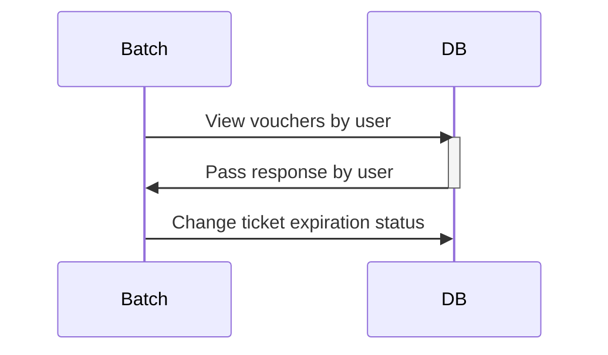
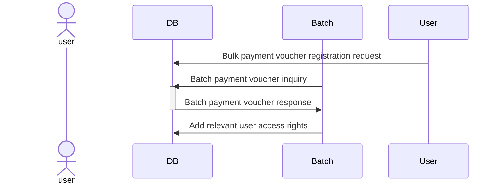
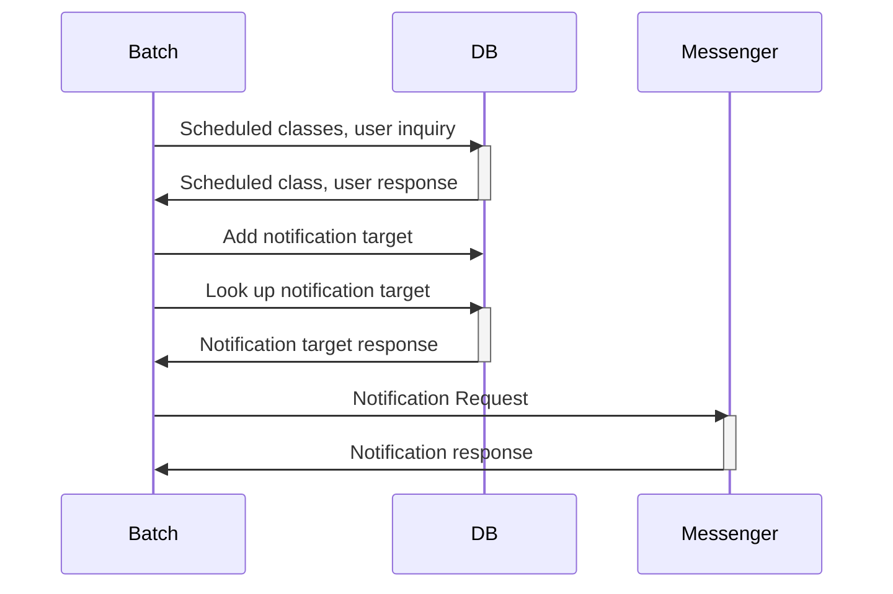
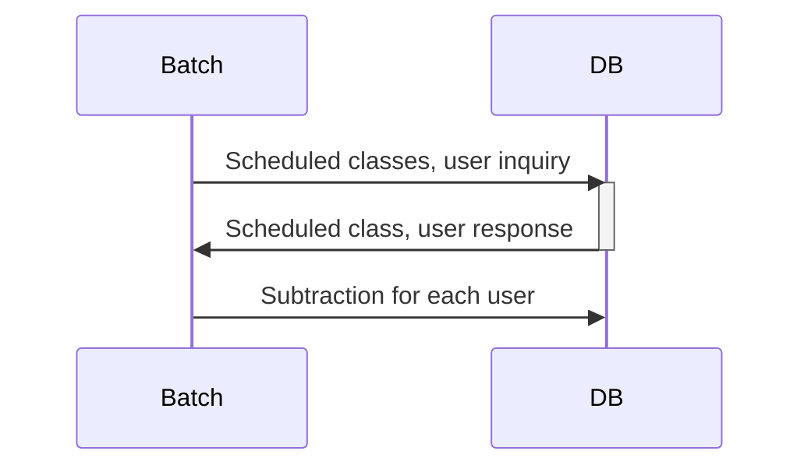

# pass-batch

This is a placement repository within the PT ticket management service.
It provides features such as ticket expiration, lump sum payment, notification before class, and ticket deduction after class.

## Environments
* OpenJDK 17.0.1 
* Spring Boot 2.7.17 
* Gradle 
* MySQL (Docker)
* JPA 
* lombok 
* ModelMapper

## Process
### Pass expiration

### Bulk payment of vouchers

### Reminder before class

### Voucher deducted after class

